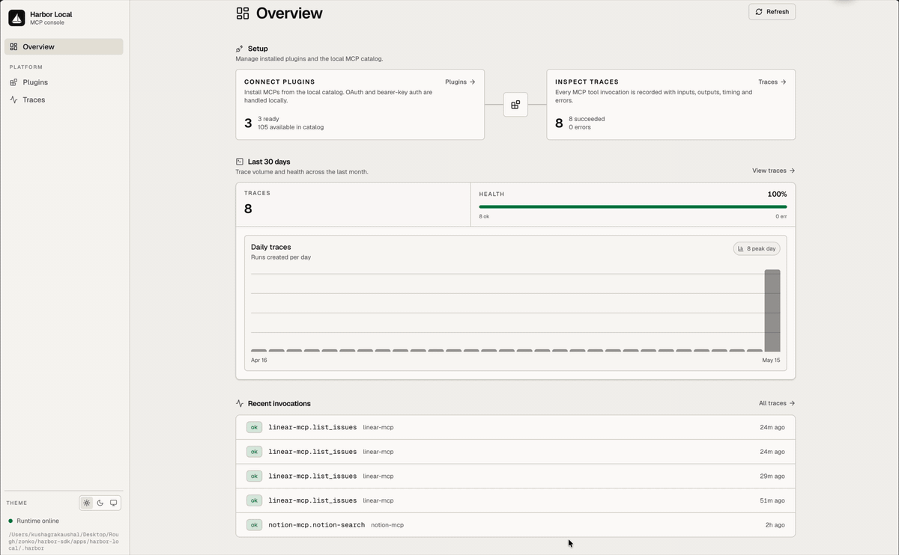

<div align="center">


# Harbor SDK

**Publish-ready TypeScript and Python packages for building with Harbor.**

Promise-first TypeScript clients, sync and async Python clients, generated
protocol types, runtime execution results, plugin and registry contracts,
platform adapters, and a local Harbor-compatible development server with a
built-in browser frontend.

[](https://www.typescriptlang.org/)
[](https://bun.sh/)
[](https://modelcontextprotocol.io/)
[](./LICENSE)
[](#roadmap)

Prefer the hosted control plane with workspace-scoped credentials, team sharing,
and the full Harbor dashboard? Use **[tryharbor.ai](https://tryharbor.ai)**.

</div>

---

<div align="center">
  
</div>

---

## Table of Contents

- [Why Harbor SDK](#why-harbor-sdk)
- [Public Packages](#public-packages)
- [Key Features](#key-features)
- [Architecture at a Glance](#architecture-at-a-glance)
- [Quickstart](#quickstart)
- [Use the Client](#use-the-client)
- [Use the Python Client](#use-the-python-client)
- [Local Platform Frontend](#local-platform-frontend)
- [Examples](#examples)
- [Project Layout](#project-layout)
- [Development](#development)
- [Security Model](#security-model)
- [Publishing](#publishing)
- [Roadmap](#roadmap)
- [License](#license)

---

## Why Harbor SDK

Most agent and tool integrations end up in one of two weak shapes:

1. Hardcoded provider clients inside the app or agent, with little auditability.
2. A hosted platform dependency before the developer has proved the workflow.

Harbor SDK keeps the public package surface small while still exposing the real
building blocks:

- app code can use a normal Promise client through `@hrbr/client`,
- system code can import stable Harbor namespaces through `@hrbr/sdk`,
- local development can run a Harbor-compatible server and frontend without the
  hosted dashboard,
- runtime results preserve raw JSON and expose language-friendly content blocks
  for text, JSON, and explicit skill bundles.

This repo is the publish-shaped package repo. Source generation still happens in
the Harbor monorepo; this repository stores the npm artifacts and runnable
examples in the shape external developers consume.

---

## Public Packages

| Package | Purpose |
| --- | --- |
| `@hrbr/client` | Promise-first Harbor API client for application, browser, integration, CLI, and server authors. Includes `@hrbr/client/effect` for Effect-native hosts. |
| `@hrbr/sdk` | Composite system SDK facade for Harbor runtime, platform, inspect, plugin, protocol, registry, Orbit, and control-plane contracts. |
| `harbor-sdk` | Python client SDK from `packages/python`, with sync and async clients over the same generated Harbor protocol. |

The intended public TypeScript surface is two package identities. The Python
surface is one distribution package named `harbor-sdk` with import package
`harbor_sdk`. In the current pre-release lane, all three packages are
distributed as GitHub release artifacts rather than npm or PyPI registry
publishes. Leaf runtime/protocol/platform packages stay behind `@hrbr/sdk`
unless there is a concrete reason to expose a new public product.

---

## Key Features

| Capability | What you get |
| --- | --- |
| Promise-first client | `createHarborClient()` returns ordinary Promises for app and integration code. |
| Effect variant | `@hrbr/client/effect` exposes the same client surface as Effect values and a layer. |
| Python client | `HarborClient` and `AsyncHarborClient` expose sync/async Python calls with typed runtime content blocks. |
| Generated protocol client | `harbor.api` and `@hrbr/client/generated/harbor` expose generated Harbor API resources and types. |
| Explicit auth modes | Workspace API keys, bearer tokens, token providers, OAuth authorize URL helpers, and device-login helpers. |
| Runtime results | `runtime.execute` preserves raw `result` and typed `content` blocks, including explicit skill bundles. |
| System namespaces | `@hrbr/sdk` exports `Agents`, `Core`, `Inspect`, `Orbit`, `Platform`, `Plugins`, `Protocol`, `Registry`, and `Runtime`. |
| Focused subpaths | Narrow imports such as `@hrbr/sdk/inspect`, `@hrbr/sdk/core/trigger`, `@hrbr/sdk/registry`, and `@hrbr/sdk/platform/local`. |
| Local server | `@hrbr/sdk/platform/local` can initialize a local project, serve Harbor-compatible routes, record runs, and host a small frontend. |
| Packaged artifacts | Package directories contain `dist`, declaration files, modern `exports`, and release metadata. |

---

## Architecture at a Glance

```text
┌────────────────────────────────────────────────────────────────────┐
│                    Application / agent / integration                │
│       browser app, server job, CLI, desktop app, or test harness     │
└─────────────────────┬───────────────────────────┬──────────────────┘
                      │                           │
                      ▼                           ▼
          ┌──────────────────────┐     ┌──────────────────────────┐
          │     @hrbr/client     │     │        @hrbr/sdk          │
          │ Promise API client   │     │ Composite system facade   │
          │ Effect subpath       │     │ Core/Runtime/Platform/... │
          └──────────┬───────────┘     └───────────┬──────────────┘
                     │                             │
                     ▼                             ▼
       Hosted Harbor API                 Local platform / contracts
       https://api.tryharbor.ai          @hrbr/sdk/platform/local
                     │                             │
                     ▼                             ▼
           workspaces, runs,         local project store, run records,
           plugins, sources,         local frontend, runtime host hook
           triggers, workflows
```

---

## Quickstart

> Prerequisites: [Bun](https://bun.sh/) 1.3+ and Node 22+.

```bash
git clone https://github.com/zonko-ai/harbor-sdk.git
cd harbor-sdk
bun install
bun run typecheck
bun run smoke
bun run python:sdk:test
```

Run the local frontend example:

```bash
bun run --filter local-platform-example serve
```

Open the printed `http://127.0.0.1:<port>` URL. The example uses
`local-token` as its bearer token when the frontend asks for auth.

Install the current release artifacts directly from GitHub:

```bash
npm install https://github.com/zonko-ai/harbor-sdk/releases/download/v0.1.2/hrbr-client-0.1.2.tgz
npm install https://github.com/zonko-ai/harbor-sdk/releases/download/v0.1.2/hrbr-sdk-0.1.2.tgz
python -m pip install https://github.com/zonko-ai/harbor-sdk/releases/download/v0.1.2/harbor_sdk-0.1.2-py3-none-any.whl
```

---

## Use the Client

```ts
import { createHarborClient } from '@hrbr/client'

const harbor = createHarborClient({
  baseUrl: 'https://api.tryharbor.ai',
  workspaceId: process.env.HARBOR_WORKSPACE_ID!,
  auth: { kind: 'api_key', key: process.env.HARBOR_API_KEY! },
})

const exec = await harbor.runtime.execute({
  code: 'return "hello from Harbor"',
})

console.log(exec.result)
console.log(exec.content?.[0])
```

For browser and app-owned OAuth flows, keep token storage in the application and
pass a provider into the client:

```ts
const harbor = createHarborClient({
  baseUrl: 'https://api.tryharbor.ai',
  auth: {
    kind: 'bearer',
    tokenProvider: async () => await getCurrentAccessToken(),
  },
})

const workspaces = await harbor.workspaces.list({ limit: 25 })
```

Use `@hrbr/client/effect` when the host application wants Effect-native calls
instead of Promises.

---

## Use the Python Client

```python
from harbor_sdk import HarborClient

client = HarborClient(
    api_key="hrbr_...",
    workspace_id="workspace_...",
)

run = client.runtime.execute(code='return "hello from Harbor"')

print(run.result)
for block in run.content or []:
    if block.type == "text":
        print(block.text)
    elif block.type == "json":
        print(block.json_)
    elif block.type == "skill_bundle":
        print(block.skill.slug)
```

Async hosts use the same shape:

```python
from harbor_sdk import AsyncHarborClient

client = AsyncHarborClient(
    api_key="hrbr_...",
    workspace_id="workspace_...",
)

run = await client.runtime.execute(code='return "hello from Harbor"')
```

`api_key` defaults to `HARBOR_API_KEY`, `workspace_id` defaults to
`HARBOR_WORKSPACE_ID`, and `base_url` defaults to `https://api.tryharbor.ai`.
The generated protocol layer is exposed as `harbor_sdk_generated`; application
code should prefer the public `harbor_sdk` facade.

---

## Local Platform Frontend

`@hrbr/sdk/platform/local` is the SDK-local infrastructure surface. It is not
the full hosted Harbor dashboard, but it is enough to exercise a local
Harbor-compatible server and frontend.

```ts
import { createHarborClient } from '@hrbr/client'
import { Effect } from 'effect'
import { initLocalProject, startLocalHarborServer } from '@hrbr/sdk/platform/local'

const project = initLocalProject({
  workspaceId: 'workspace_local',
  workspaceName: 'Local SDK Workspace',
  authToken: 'local-token',
})

const server = await startLocalHarborServer({
  project,
  authToken: 'local-token',
  runtimeHost: (invocation) =>
    Effect.succeed({
      mode: invocation.request.mode,
      result: { ok: true, scopeId: invocation.context.scopeId },
      logs: [],
      warnings: [],
      timings: {},
    }),
})

const harbor = createHarborClient({
  baseUrl: server.url,
  workspaceId: 'workspace_local',
  auth: { kind: 'bearer', token: 'local-token' },
})

await harbor.runtime.execute({ code: 'return { ok: true }' })
```

The server exposes the SDK-local frontend at `/`, the frontend script at
`/local/frontend.js`, health at `/healthz`, and Harbor-compatible JSON
routes for the local workspace/run flow used by the examples.

---

## Examples

| Example | What it shows |
| --- | --- |
| `examples/browser-client` | Browser/app integration with caller-owned bearer token state. |
| `examples/client-promise` | Promise runtime execution and content blocks for text plus explicit skill bundles. |
| `examples/python-client` | Offline Python client call showing text, JSON, and skill-bundle content blocks. |
| `examples/sdk-system` | Root namespace imports, the inspect namespace, and focused subpaths from `@hrbr/sdk`. |
| `examples/local-platform` | Local project, local server, SDK client call, and built-in frontend. |

Run all examples through the smoke command:

```bash
bun run smoke
```

---

## Project Layout

```text
harbor-sdk/
├── docs/assets/              # logo and demo media used by this README
├── examples/
│   ├── browser-client/
│   ├── client-promise/
│   ├── python-client/
│   ├── local-platform/
│   └── sdk-system/
├── packages/
│   ├── client/               # generated @hrbr/client package
│   ├── python/               # Python harbor-sdk package
│   └── sdk/                  # generated @hrbr/sdk package
├── LICENSE
├── package.json
└── README.md
```

---

## Development

```bash
bun install
bun run typecheck
bun run smoke
bun run pack:dry-run
bun run python:sdk:test
```

The package directories are generated artifacts. For broad source changes,
refresh them from the Harbor monorepo publish pipeline, then re-run the checks
above in this repository.

---

## Security Model

- `@hrbr/client` does not own browser cookies, OAuth refresh storage, or app
  sessions. The host application owns credentials and passes a token or provider.
- Workspace API-key clients require an explicit `workspaceId` before runtime
  and workspace-scoped helper calls.
- Skill bundles are never inferred from arbitrary returned objects. User code
  must return the explicit Harbor execute-result envelope for SDKs to expose a
  loadable skill bundle.
- The local platform server is for single-user development and test harnesses.
  Keep it on loopback and configure `authToken` when exposing the frontend.
- The hosted Harbor dashboard, WorkOS/AuthKit configuration, shared credential
  vault, and team governance live in the Harbor product, not in this package
  repository.

---

## Release Artifacts

The current release flow builds GitHub release artifacts from the package
directories after generated artifacts have been refreshed and verified:

```bash
bun run python:sdk:pack
npm pack ./packages/client --pack-destination tmp/release-artifacts
npm pack ./packages/sdk --pack-destination tmp/release-artifacts
cp tmp/python-dist/harbor_sdk-*.whl tmp/release-artifacts/
```

Upload the three files in `tmp/release-artifacts` to the matching GitHub
release tag. Do not publish to npm or PyPI unless the registry release lane has
explicitly been opened.

---

## Roadmap

- [ ] Open the npm registry release lane for `@hrbr/client` and `@hrbr/sdk`.
- [ ] Open the PyPI registry release lane for `harbor-sdk`.
- [ ] Add more framework examples for browser, server, CLI, and worker hosts.
- [ ] Keep local platform frontend examples aligned with the hosted Harbor API
      contract.
- [ ] Add release automation that proves pack/install smokes before publish.

---

## License

Released under the [MIT License](./LICENSE).

<div align="center">

Built by Zonko Team

</div>
