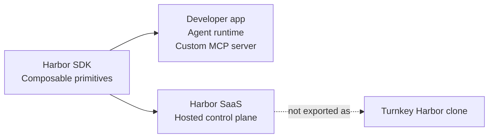
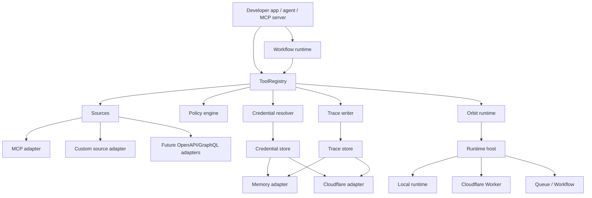
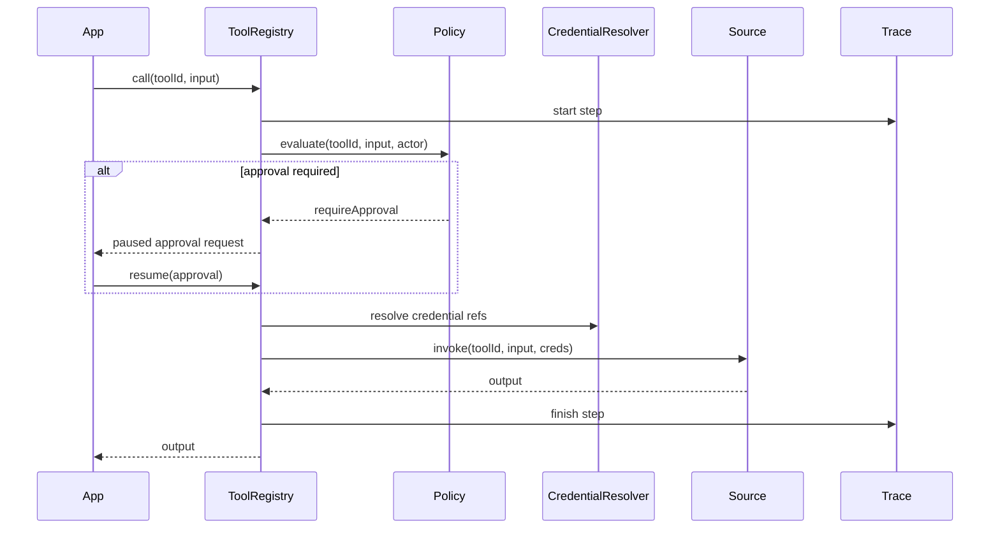
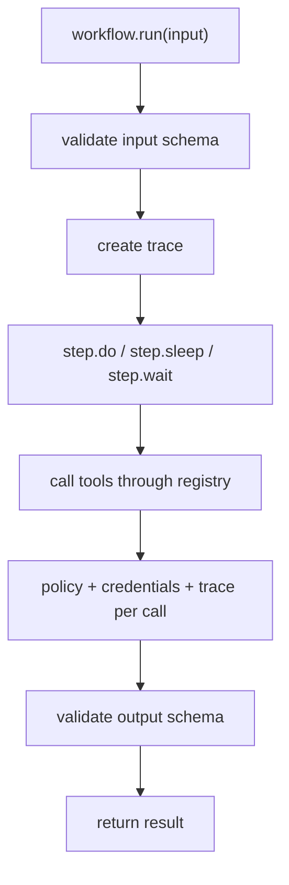

# Harbor SDK primitive spec

This spec defines the public SDK direction for Harbor primitives. The SDK should
give developers low-level blocks for agent/tool runtimes without packaging the
Harbor SaaS product as a cloneable framework.

## Product boundary

Harbor SaaS is the productized control plane: dashboard, workspace admin,
billing, OAuth app setup, hosted execution, audit UI, source marketplace, team
workflows, and policy administration.

Harbor SDK is the primitive layer: schemas, registries, source adapters, tool
calling, workflow definitions, credential interfaces, policy evaluation, trace
writers, execution contracts, and storage/runtime adapters.

The public SDK must not present a turnkey `createHarbor()` surface.



## Goals

- Let developers connect their own plugins, sources, workflows, credentials,
  policies, traces, and runtime/storage adapters.
- Keep Harbor SaaS differentiated as the complete hosted product.
- Make useful slices easy to compose without implying that the SDK is a SaaS
  scaffold.
- Preserve Harbor's workspace, source, tool, policy, execution, and trace model.
- Support Cloudflare as a first-class adapter target without making raw
  Cloudflare bindings the public domain model.

## Non-goals

- No public `createHarbor()` all-in-one API.
- No "build your own Harbor dashboard" starter.
- No frontend component, page-template, or rendered UI package surface.
- No turnkey workspace, billing, OAuth-admin, or SaaS-control-plane scaffold.
- No raw secrets-as-strings API.
- No raw D1/R2/KV/Durable Object exposure as the primary model.
- No local hacks that fork Harbor's control-plane model away from the hosted
  product.

## Package shape

```text
@hrbr/source-core          source adapter interface and custom adapter helper
@hrbr/source-mcp           developer-owned MCP HTTP source adapter
@hrbr/source-credentials   credential store/resolver primitives
@hrbr/source-policy        allow/block/approval policy engine
@hrbr/tools                local tool registry, search, describe, schema, call
@hrbr/runs                 run graph contracts and memory trace writer
@hrbr/workflows            defineWorkflow, runWorkflow, step runtime contracts
@hrbr/orbit                Orbit schemas, app/job contracts, and runtime adapters
@hrbr/client               hosted Harbor API client implementing selected SDK interfaces
@hrbr/sources              hosted/source lifecycle contract types
@hrbr/workspaces           workspace reader contract types
```

The hosted API client is only one adapter. It should reuse the same public
concepts where practical, but it must not define the architecture.

Future adapter packages can add OpenAPI, GraphQL, Cloudflare persistence, or
MCP-server exposure on top of these contracts. They should follow the same
primitive shape instead of introducing a turnkey SaaS scaffold.

## Core architecture



## Public API shape

The API should be primitive-first:

```ts
const registry = createToolRegistry({
  sources: [
    mcpSource({ namespace: "github", endpoint: "https://..." }),
    openApiSource({ namespace: "stripe", spec: "./stripe.openapi.json" }),
    graphqlSource({ namespace: "linear", endpoint: "https://..." }),
  ],
  credentials,
  policy,
  traces,
})

const matches = await registry.search({ query: "create issue", limit: 5 })
const schema = await registry.describe(matches[0].id)
const result = await registry.call(matches[0].id, input)
```

Orbit runtime blocks compose the same way. They are adapter contracts for a
developer-owned runtime, not a public SaaS scaffold:

```ts
const orbit = createMemoryOrbitRuntime({
  tools,
  socket,
  db,
  ai,
})

await orbit.storage.put({
  key: "tickets/ticket_123.json",
  data: { id: "ticket_123" },
  encoding: "json",
})

const ticket = await orbit.db?.first(
  "select * from tickets order by created_at desc limit 1",
)
```

Workflows compose the same registry rather than bypassing it:

```ts
const workflow = defineWorkflow({
  name: "triage-issue",
  input: IssueInput,
  output: TriageResult,
  run: async ({ input, tools, step }) => {
    const issue = await step.do("load issue", () =>
      tools.github.issues.get(input),
    )

    const customer = await step.do("lookup customer", () =>
      tools.stripe.customers.search({ email: issue.email }),
    )

    return { issue, customer }
  },
})
```

## Tool call flow



## Source adapter contract

Source adapters are protocol constructors. They discover tools, describe tool
schemas, and invoke tools through a common context.

```ts
interface SourceAdapter {
  readonly kind: "mcp" | "openapi" | "graphql" | string

  discover(config: SourceConfig): Promise<DiscoveredSource>
  listTools(source: SourceRef): Promise<ToolDefinition[]>
  describe(toolId: ToolId): Promise<ToolSchema>
  call(toolId: ToolId, input: unknown, ctx: ToolCallContext): Promise<unknown>
}
```

Custom adapters should be able to participate in search, describe, call,
credential resolution, policy evaluation, and trace writing without depending
on Harbor SaaS internals.

## Workflow flow



## Cloudflare adapter scope

Cloudflare should be exposed as adapter infrastructure, not as the SDK's public
domain model.

```ts
const runtime = createExecutionRuntime({
  storage: cloudflareStorage({
    d1: env.DB,
    r2: env.BUCKET,
    kv: env.KV,
  }),
  traces: cloudflareTraceStore({
    d1: env.DB,
    r2: env.TRACES,
  }),
  credentials: cloudflareCredentialStore({
    d1: env.DB,
    secrets: env.SECRETS,
  }),
})
```

The same primitive interfaces should also support in-memory adapters for tests
and examples.

Current implemented local adapters:

- `createMemoryCredentialStore` / `createCredentialResolver`
- `createMemoryTraceWriter`
- `createMemoryOrbitRuntime`
- `defineSourceAdapter`
- `createToolRegistry`

Current hosted adapters:

- `createHarborClient().tools`
- `createHarborClient().sources`
- `createHarborClient().workspaces`
- `createHarborClient().runs`

## Hosted Harbor client

`@hrbr/client` may implement a subset of the primitive interfaces over Harbor
SaaS APIs:

```ts
const tools = harborClient.tools({
  apiKey: process.env.HRBR_API_KEY,
  workspace: "workspace-id",
})

const matches = await tools.search({ query: "send email" })
const result = await tools.call(matches[0].id, input)
```

This is an API client, not the canonical SDK architecture. It exists so hosted
Harbor users can call the same concepts remotely.

## Example status

Shipped and compileable:

- `examples/sdk-custom-source`: custom source adapter, developer-owned MCP HTTP
  source, credential references, policy gates, trace writer, and workflow.
- `examples/sdk-tool-catalog`: hosted Harbor client as an API adapter for tool
  catalog reads.
- `examples/sdk-orbit-runtime`: Orbit runtime composition with storage/cache,
  usage, tools, socket, DB, and AI adapters.

Future examples:

- OpenAPI source adapter once that package exists.
- GraphQL source adapter once that package exists.
- Cloudflare persistence adapters for credentials/traces/runtime state.
- Expose selected registry tools as an MCP server.

## Examples to avoid

- `createHarbor()`.
- "Build your own Harbor dashboard."
- "Deploy a Harbor clone."
- Turnkey workspace, billing, or OAuth-admin scaffolding.
- Full SaaS control-plane starter.

## Recommendation

Build the SDK as composable primitives with adapters. Harbor SaaS should consume
the same primitives internally, but the public SDK should teach developers how
to assemble useful slices, not how to recreate the full product.

Current compileable examples are listed in **Example status** above and are
covered by `tests/sdk-platform-manual-test.md`.
